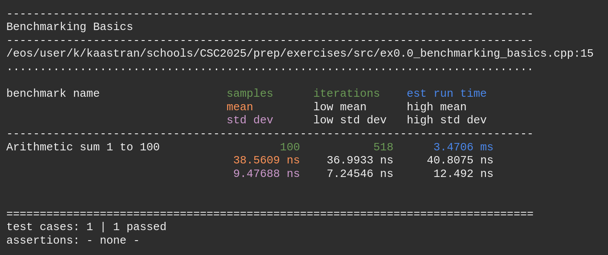

# Tools and techniques 3: Performance - Exercises #

## Introduction

Welcome to this exercise session! This suite of exercises comes in three chapters; 0. Benchmarking basics, 1. Algorithmic complexity, and 2. Memory access patterns. I suggest that you start off by doing the 0th exercises, which act as a tutorial for the tools of the session. After that, you can choose how to proceed freely.

Before you start, you need to set up your working environment on LXPLUS, the CERN cluster service. I've compiled instructions on this below for those who aren't used to this kind of thing. You can either ssh in from a terminal window (Windows: *Command prompt*, *Powershell*; Mac, Linux: *Terminal*), or through a code editor like VSCode (though for some reason, I've had some trouble doing the latter recently).
- ssh into LXPLUS
    - `ssh -X USERNAME@lxplus.cern.ch`
- get access to the C++ compiler and the Catch2 library
```
source /cvmfs/sft.cern.ch/lcg/views/LCG_107a/x86_64-el9-gcc13-dbg/setup.sh
```
- optionally, create and navigate to a folder of your choosing
    - `mkdir your_favorite_folder`
    - `cd your_favorite_folder`
- clone the git repo with the exercise material
```
git clone https://github.com/Stoneandbeach/CSC2025.git
```
- navigate to the folder of the cloned repo
    - `cd CSC2025`
- run CMake to compile the various programs of the exercises
	- `cmake -B build` (this creates build configuration files in the *build/* directory)
	- `cmake --build build` (this compiles the programs into executable files in the *build/* directory. Note: you'll need to rerun this step each time you've made changes to the code)
- note that when running a program in the local directory, the LXPLUS Linux system requires you to specify this by adding "./" in front of the file name
    - `./your_program`
- if needed, cancel a running program by pressing CTRL + C
- to edit files on LXPLUS, you can use for example the **Nano** or **Vim** text editors
    - `nano file_to_edit.cpp`
    - **Nano** is fairly straight-forward, but some shortcuts might be different compared to what you're used to. A cheat sheet for **Nano** is found here: [Nano cheat sheet](https://www.nano-editor.org/dist/latest/cheatsheet.html)

Each exercise corresponds to one or more programs in the *src/* folder. Note: for **Exercise 1.0**, don't read the code before running the exercise or you might get the answers spoiled!

## Catch2 ##

One of the benchmarking tools we'll be using it **Catch2**. I write more about how this works below, but first, a few notes on how to read the results that **Catch2** produces.



When you run a **Catch2** benchmark, you get some output that might look like this. Here, "Benchmarking Basics" is the name of this run (known as a **test case**) and the specific benchmark is called "Arithmetic sum 1 to 100". In green, you see **samples** and **iterations**. By default, Catch2 will start the benchmark 100 times, and for each time, it will run and time the code inside some **iterations** number of times, which it uses to calculate stable averages.

In orange, you see the mean runtime per iteration, and in purple the standard deviation of the population of runs. Here we see a standard deviation of about 25% of the mean, which is not unexpected; 100 samples is still quite low.

Finally, in blue you see an estimation of how long **Catch2** thinks this benchmark will take to run. You might want to keep an eye on this number if you're running slow benchmarks...

When looking at this information, remember to be a bit sceptical. Remember variance. If the standard deviation is large, you might want to rerun a few times, or tell Catch2 to use more samples to get more stable results. Add the "--benchmark-samples" flag when running the benchmark:
- `./your_program --benchmark-samples 500` 

Now - onto the exercises!

## Exercise 0.0 - Benchmarking basics

> Related code: *src/ex0.0_benchmarking_basics.cpp*

This is our first look at benchmarking using **Catch2**. It covers how to set up a basic benchmark and use it to time a function. 

**Your task is to study the benchmarking results of the code I've written, and then try to improve upon them...**

**TEST_CASE** is a macro used by **Catch2** to setup - unsurprisingly - a test case. Under the hood, it will create a `main` function and put your code in it. In the **TEST_CASE**, you can have one or several **BENCHMARK**s.

**BENCHMARK** is another macro that sets up timing code, and then runs and times what you put in the **BENCHMARK** `{ }` braces. Note that to be sure that the compiler does not optimize away the code you are benchmarking, add a `return` statement in the **BENCHMARK** (see *src/ex0.0_benchmarking_basics.cpp* for an example).

Suggestions for the exercise:
- Read through and get familiar with the code.
- Run *build/ex0.0* and study the results. 
- Add a couple of **BENCHMARK**s with a different upper limits, recompile the program and run it. Does the runtime change as expected?
- Implement a function `smarter_arithmetic_sum` that does the arithmetic sum in a more efficient manner (there is, for example, a formula...). Add a **BENCHMARK** for your smarter function and compare the results to my inefficient version. Was yours faster?
- Remove the `volatile` keyword from the original smarter_arithmetic sum and rerun. What happens? Why?

> Given that the input to the arithmetic sum is *N*, what algorithmic complexity is your version, and what is mine?

## Exercise 0.1 - The time command

> Related code: *src/ex0.1_time.cpp*

This exercise has an implementation of a function to sum all the values in a vector. It sets up a vector with length *N*, with value from 0 to *N* - 1, and calcutes the sum.

**Your task is to use the Linux `time` command to time the *build/ex0.1* program.**

Suggestions for the exercise:
- Read through and get familiar with the code.
- Use `time` to time the *build/ex0.1* program. Run it a number of times and note the results. You'll compare this with the results of the next exercise.

> How much do the results fluctuate, and why?

## Exercise 0.2 - Benchmarking advanced

> Related code: *src/ex0.2_benchmarking_advanced.cpp*

Now we'll use **Catch2** to set up a more advanced benchmark. In **Exercise 0.0**, **BENCHMARK** timed whatever you put between its `{ }`, which was sufficient for the arithmetic sum. Let's say you instead have a program that 1) sets up a vector of data, and 2) processes it, and you only want to time the processing part. For that we have the slightly more complicated **BENCHMARK_ADVANCED** macro.

**BENCHMARK_ADVANCED** can be seen as having two parts; some setup code will be run first, and then the code that will be benchmarked. In addition to a benchmark name, **BENCHMARK_ADVANCED** takes a timing object as input. For that we will be using an instance of the `Catch::Benchmark::Chronometer` class, which we can simply name `timer`. The code in the `{ }` block of the `timer.measure` method is what is actually timed by the **BENCHMARK_ADVANCED**. Technically, the whole content of the `timer.measure` parenthesis `( )` is a lambda function. The `[&]` indicates that this function is able to access variables from outside the `( )` by reference. This lets us use 'vect' in the timed code block.

Suggestions for the exercise:
- Like last time, familiarize yourself with the code and then run *build/ex0.2* and study the results.
- Implement a new BENCHMARK_ADVANCED("Vector sum 0 to 10000") and compare results. How does `vector_sum` scale with input size?

> How do the **Catch2** results compare to the results of **Exercise 0.1**? Why?

## Tutorial complete!

Coming up are exercises on algorithmic complexity (*ex1.\**) and memory access patterns (*ex2.0*). They do not need to be done in any particular order. Feel free to choose your own adventure and do as much as you want and have time for, based on what you are interested in and want to learn about!

## Exercise 1.0 - Scaling

> Note! The code for this exercise contains spoilers! Do not read it until you're ready to get answers.
> Related code:
> - *src/ex1.0_scaling.cpp*
> - *src/algorithms/ex1.0_algorithms.cpp*
> - *src/algorithms/ex1.0_algorithms.hpp*
> - *src/parameters.cpp* (spoiler free)

Below, you will find a list of five algorithms and their time complexities. You also have code implementing and benchmarking these algorithms - but you do not know which is which!

**Your task is to use the timing information from the benchmarks to gauge the time complexity of the unknown algorithms, and figure out which benchmark corresponds to which algorithm.**

The anonymised algorithms are:
- Bubble sort *O*(*n*<sup>2</sup>)
- Heap sort *O*(*n* log *n*)
- Radix sort *O*(*n*)
- Count instances of value in vector *O*(*n*)
- Assign value to vector element *O*(1)

Suggestions for the exercise:
- Run *build/ex1.0* and study the results.
- By editing the size of the input to the algorithms *N* in *src/parameters.hpp*, gather timing information on the benchmarks at several different input scales.
- Using your favorite plotting tools, plot runtime as a function of *N* to see how the benchmarks scale. Based on this, figure out which algorithms is hiding behind each benchmark.
- Finally, confirm by reading the code in the various files.
- See below for hints!

> Which benchmark corresponds to which algorithm? Do they behave as expected, based on their time complexities?

## Exercise 1.1 - Complexity ##

> Related code (no risk of spoilers this time):
> - *src/ex1.1_complexity.cpp*
> - *src/algorithms/ex1.1_algorithms.cpp*
> - *src/algorithms/ex1.1_algorithms.hpp*
> - *src/parameters.cpp*

This time, you've been given code implementing and benchmarking five new algorithms, but you don't know what they do or what their time complexity is.

**Your task is to read the code implementing the algorithms and figure out their time complexities.**

Suggestions for the exercise:
- Study the code in *src/algorithms/ex1.1_algorithms.cpp*.
- You can study the setup code in *src/ex1.1_complexity.cpp* for possible additional hints.
- Determine the time complexity of each algorithms.
- Confirm by running the *build/ex1.1* benchmarks for a range of input sizes *N* and plot the results like last time.
- See below for hints!

> What are the time complexities of the algorithms? What do they actually do?

## Exercise 1 hints ##

Below are a list of hints for algorithmic complexity exercises. Feel free to use them, or wait with reading them until you feel you need them!
- Playing with logarithmic scale on the axes of the plots can be a big help.
- Normalising all the measurement points of a benchmark by the first point, so that the first point is always = 1, can make it easier to see how different algorithms scale.
- In practice, not every "computational step" is the same. Additionally, there can be different amounts of overhead to different algorithms. This means that two different *O*(*N*) algorithms might not behave the same.
- You may need quite a large range of values of *N* to get good results, considering the previous point.
- If some algorithms start to get really slow with large *N*, you can disable them by commenting out the `#define`s in *src/parameters.hpp*. For example, commenting out `#define BENCH1` will prevent the benchmark "algorithm_1" from running.

## Exercise 2.0 - Measuring cache size ##

> Related code: *src/ex2.0_cache.cpp*

You've been given a program that behaves in a decidedly cache-unfriendly manner, exhibiting bad memory access patterns while processing a vector. You can use the Linux `perf` tool in order to study how the number of L1 cache misses and the runtime of program depend on the size of the vector in bytes *N*.

**Your task is to determine the size of the L1 data cache on your machine, using information of cache hits and misses.**

`perf stat YOUR_PROGRAM` gathers a default set of statistics on your program, like runtime. There is however a lot more that `perf` can tell you. To get access to L1 cache information, you need to specify that you want to see the "events" related to L1 cache.

`perf stat -e L1-dcache-loads,L1-dcache-load-misses YOUR_PROGRAM` records the number of times data is loaded from L1 cache, and how many times requested data is not found in L1 cache - i.e. cache hits and misses. Note that L1 cache is actually split into two parts; **dcache**, which is used for data like your vector, and **icache**, used for CPU instructions, i.e. the actual machine code translation of the program you're running. We want to study how well this program uses the **dcache**.

To see the full list of statistics that perf can track, run `perf list`. There's a lot! They can however be a bit tricky to figure out what they mean (and they can mean different things on different hardware).

Suggestions for the exercise:
- Examine the code. What is it doing?
- How does the code achieve pseudo-random vector accesses? Why is this cache unfriendly?
- Run *build/ex2.0* and study the output.
- Use `perf` to gather statistics on *build/ex2.0*. Record L1 dcache loads and misses for a range of vector sizes, by changing the *SIZE* `#define` and recompiling.
- Plot the trend of the fraction of L1 dcache loads that miss as a function of the vector size in bytes. How and why do the L1 cache misses depend on the vector size?
- Similarly, plot the trend of the time required per step of the loop as a function of vector size.

> Can you determine the size of the L1 data cache on your machine?  
> The runtime does not follow the same trend as the cache misses. When does it start to change? Why?

**Hint:** once you have your results, you can run `getconf -a | grep CACHE` to see the properties of the cache on your machine.